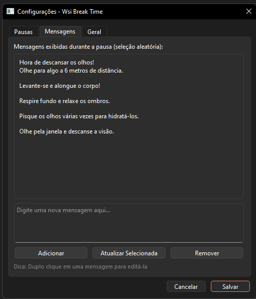

# Wsi Break Time

Windows app that reminds you to take breaks while working on your computer. Simple, effective, and lives in your system tray.

## Screenshots

<p align="center">
  
  
</p>

<p align="center">
  
  
</p>

## Why?

Extended screen time causes eye strain, back pain, and fatigue. This tool interrupts you at regular intervals with a fullscreen overlay forcing you to actually take a break.

## Features

- Configurable break intervals (default: every 20 minutes)
- Fullscreen dark overlay with countdown
- Multiple random break messages
- Water drinking reminders
- Skip or postpone breaks when needed
- System tray integration
- Pre-break notifications
- **Recurring TODOs** with scheduled times and verification codes
- Lightweight (~35MB)

## Download

Get the latest release from the [Releases](../../releases) page. No installation needed - just run `WsiBreakTime.exe`.

## Usage

1. Run `WsiBreakTime.exe`
2. Look for the "W" icon in your system tray
3. Right-click the icon to:
   - Pause/resume the timer
   - Take a break immediately
   - Open settings
   - Exit

### Settings

Double-click the tray icon or right-click → Settings to configure:

- **Break interval**: How often to pause (minutes)
- **Break duration**: How long each break lasts (seconds)
- **Messages**: Add/edit/remove break messages shown during pauses
- **Notifications**: Enable warnings before breaks start
- **Controls**: Allow skipping or postponing breaks
- **Water reminders**: Optional hydration alerts
- **TODOs**: Create and manage recurring tasks

### TODOs

Create recurring daily tasks with scheduled times:

1. Open Settings → TODOs tab
2. Add a TODO with title and optional description
3. Check "TODO Recorrente (diário)" for daily tasks
4. Set the scheduled time (e.g., 09:00)
5. Click "Adicionar"

**How it works:**

- TODOs appear in the system tray menu under "TODOs Pendentes"
- At the scheduled time, you'll receive a notification
- To complete a recurring TODO, you must type an 8-character verification code
- Recurring TODOs reset automatically at midnight

### Keyboard Shortcuts

- `ESC` during a break: Skip the current break (if enabled)

## Building from Source

### Development

Requirements:
- Python 3.9+
- PyQt6

```bash
pip install -r requirements.txt
python run.py
```

### Building Executable

**Automated (Recommended):**

Windows:
```bash
build.bat
```

Linux/macOS:
```bash
chmod +x build.sh
./build.sh
```

Cross-platform (Python):
```bash
python build.py
python build.py --run  # Build and run
```

**Manual:**
```bash
pyinstaller build.spec
```

The executable will be in the `dist/` folder.

The automated scripts will:

- Check and install dependencies
- Clean previous builds
- Run basic tests
- Build the executable
- Verify the output

### Build Commands Reference

| Command                   | Description                    |
| ------------------------- | ------------------------------ |
| `python run.py`           | Run in development mode        |
| `python build.py`         | Build executable               |
| `python build.py --run`   | Build and run immediately      |
| `build.bat`               | Windows batch build            |
| `./build.sh`              | Linux/macOS build              |
| `pyinstaller build.spec`  | Manual build with PyInstaller  |

### Development Tips

1. **Quick testing**: Use `python run.py` for rapid iteration without building
2. **Clean build**: Delete `build/`, `dist/`, and `__pycache__/` folders if you encounter issues
3. **Debug imports**: Check `src/__pycache__` if modules aren't loading correctly
4. **Config reset**: Delete `%APPDATA%\WsiBreakTime\config.json` to reset settings
5. **Tray icon not showing**: Ensure no other instance is running (check Task Manager)

### Project Structure

```text
wsi-screen-break/
├── src/
│   ├── main.py          # Entry point
│   ├── app.py           # Main application & settings dialog
│   ├── timer_manager.py # Break timer logic
│   ├── tray_icon.py     # System tray integration
│   ├── overlay.py       # Fullscreen break overlay
│   ├── settings.py      # Configuration persistence
│   ├── todo_model.py    # TODO data model
│   └── todo_manager.py  # TODO scheduling & verification
├── resources/
│   ├── icons/           # Application icons
│   └── sounds/          # Alert sounds
├── build.py             # Cross-platform build script
├── build.spec           # PyInstaller configuration
├── requirements.txt     # Python dependencies
└── run.py               # Development runner
```

## Configuration

Settings are saved to `%APPDATA%\WsiBreakTime\config.json`. Delete this file to reset to defaults.

### Config File Example

```json
{
  "break_interval": 20,
  "break_duration": 20,
  "break_messages": ["Take a break!", "Rest your eyes"],
  "start_minimized": true,
  "show_pre_notification": true,
  "pre_notification_seconds": 30,
  "allow_skip": true,
  "allow_postpone": true,
  "postpone_minutes": 5,
  "water_reminder_interval": 0,
  "todos": []
}
```

## Troubleshooting

| Issue                       | Solution                                                          |
| --------------------------- | ----------------------------------------------------------------- |
| App doesn't start           | Check if another instance is running in Task Manager              |
| Tray icon missing           | Right-click taskbar → Taskbar settings → Enable system tray icons |
| Settings not saving         | Check write permissions in `%APPDATA%\WsiBreakTime\`              |
| Break overlay not fullscreen| Try restarting the app; check multi-monitor settings              |
| TODOs not resetting         | Ensure the app is running at midnight for auto-reset              |

## License

MIT

## Contributing

Pull requests welcome. Keep it simple.
